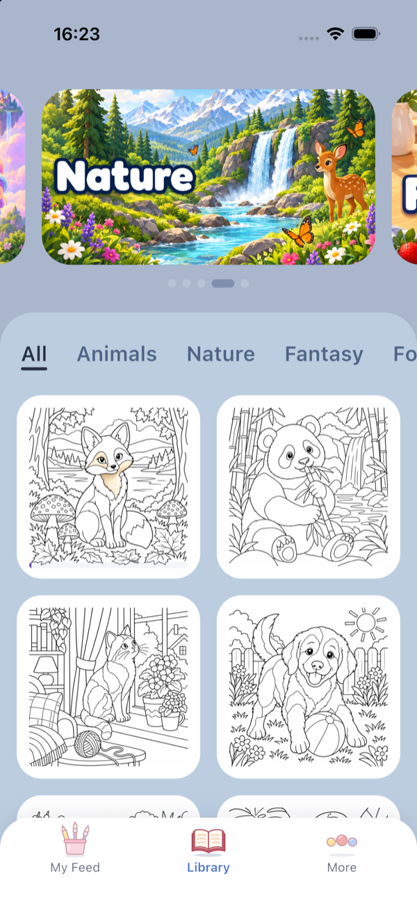
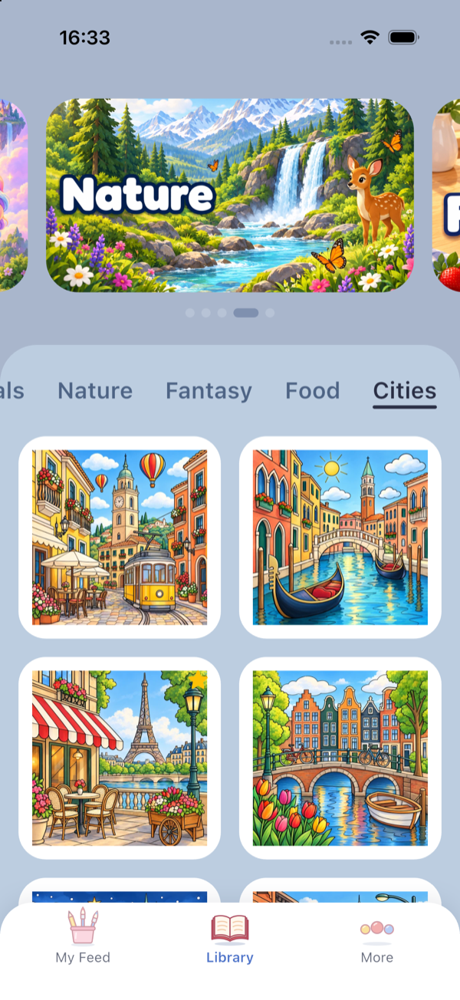
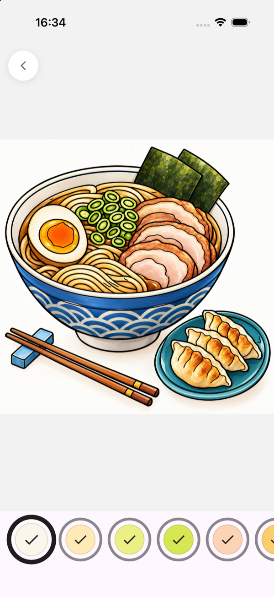

# Happy Color

Color-by-number prototype in Flutter.

<p>
  
  
  
</p>

## Pictures

Every picture is a folder in `assets/pictures/<category>/` built by `tools/generate_picture.py` from AI line art and its colored version:

- `regions.png`: the region of every pixel (index + 1 in the red and green bytes);
- `picture.json`: the palette and, per region, its color, label spot and bounds;
- `artwork.webp`, `lines.webp` and their `_thumb` copies for the grids.

```sh
pip install -r tools/requirements.txt
python tools/generate_picture.py LINES.png COLOR.png OUT_DIR
```

## How it works

- **The finished artwork is revealed, not painted.** `shaders/coloring.frag` looks up each pixel's region in the region map and shows the artwork where the region is colored.
- **Region state lives in a small texture**, one texel per region. A fill updates it and the shader grows the color out from the tap.
- **A tap reads its region straight from the region map's bytes.**
- **Numbers come from one prebuilt texture** and are drawn in a single call; numbers too small to read at the current zoom are hidden.
- **Previews of started pictures are rendered by the same shader once, saved as PNG files** and decoded at the size each screen draws them.
- **One-off work that stalls a frame waits for transitions to finish.** A page's first shader draw or a preview render happens while nothing on screen moves.
